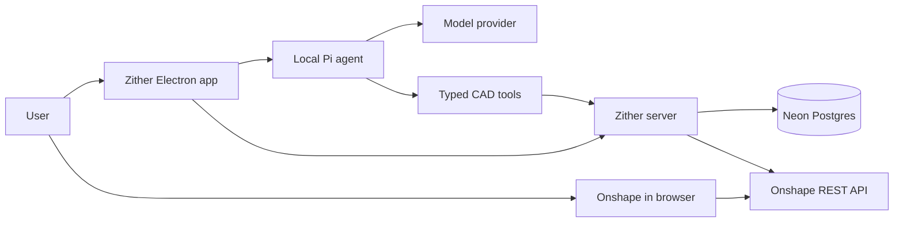

# Zither implementation plan

Zither will be a separate Electron assistant for Onshape. Users keep designing in their browser and talk to Zither in a desktop window. Pi runs the agent locally, and CAD tools call Onshape's HTTP API.

**Status:** Approved direction; the first pipeline is implemented in reviewable PRs. Live OAuth, inference, and CAD validation require configured accounts. This document records the longer-term milestones, not a claim that all acceptance checks have passed.

## Product experience

1. Open Zither and sign in to a Zither account using Google, GitHub, or username and password. Password registration also collects an email address for recovery.
2. Select **Connect Onshape**. The system browser opens Onshape's OAuth consent flow. If needed, the user signs in to Onshape there.
3. Choose an AI connection: bring an API key, or sign in to Codex with a subscription.
4. Paste the URL of an editable Onshape Part Studio into Zither. The app displays the connected document context and feature list.
5. Ask something like “What controls this extrusion?” or “Change the depth of Extrude 1 to 25 mm.”
6. Zither reads the actual feature parameters, explains or performs the requested change, and reports the result returned by Onshape. The user sees the updated design in Onshape.

The proposed onboarding starts with the Zither account so the Onshape authorization can be attached to the correct user. Onshape login and API authorization are distinct: being signed in to Onshape in a browser does not by itself authorize Zither to edit CAD.

## Architecture

The desktop renderer presents chat, connections, document context, and tool activity. Electron's main process owns the local agent, credentials, and a narrow IPC bridge. The renderer receives connection status rather than stored tokens.

The Zither server owns account authentication, desktop session handoff, Onshape OAuth token exchange and refresh, and authenticated CAD requests. It keeps the Onshape client secret out of the distributed desktop application. Neon stores application data; it is not the HTTP API or the authentication implementation.

The model runs through Pi on the user's computer. Model requests go directly to the selected provider. Onshape context needed for a task is included in those requests. Model keys and Codex credentials stay in operating-system-protected local storage. The server stores encrypted Onshape credentials and checks document requests against the signed-in user.

## Three independent connections

| Connection | Purpose | Proposed implementation |
| --- | --- | --- |
| Zither account | App identity and sessions | Better Auth with Google, GitHub, and username/password; Neon Postgres |
| Onshape account | Permission to access CAD | Onshape OAuth authorization code flow handled by the server |
| AI provider | Access to inference | Pi providers with local API keys or Codex subscription OAuth credentials |

All browser authentication opens in the system browser. Zither account login returns to the desktop through a short-lived, single-use code bound to a PKCE challenge and a validated loopback callback. OAuth state binds each authorization to the session that initiated it.

Codex is the subscription connection, using Pi's `openai-codex` provider for browser OAuth, token refresh, model selection, and inference. The separate direct ChatGPT sign-in has been removed. Verify live subscription inference and the release distribution path before shipping.

## First usable version

The first complete workflow is **connect an existing Part Studio, understand its features, and edit an existing dimension through chat**.

- Account registration, sign-in, sign-out, and restoring a desktop session.
- Onshape connection, token refresh, disconnect, and useful permission errors.
- API key connection and model selection through Pi.
- Codex subscription connection through Pi.
- Explicit document selection by URL, with document/workspace/element IDs tracked together.
- Streaming conversation, tool activity, cancellation, and starting a new chat.
- Reading the feature tree and editable parameter expressions.
- Editing a named feature parameter while preserving the rest of the feature definition.
- Clear reporting of successful rebuilds, feature errors, changed documents, and rate limits.

This first version targets editable Part Studios on `cad.onshape.com` in the default configuration. Automatic detection of the active browser tab, enterprise domains, assemblies, drawings, and arbitrary geometry creation follow after the basic edit workflow works.

## CAD execution rules

The agent receives purpose-built tools such as `get_part_studio_features` and `set_feature_parameter`. It does not need unrestricted shell access or a generic HTTP tool to edit CAD.

Before an edit, read the current feature definition and resolve the feature ID, parameter ID, expression, and source microversion. Preserve fields that are not being edited. Send the source microversion with skew rejection so an intervening browser edit cannot be silently overwritten. [Onshape feature API documentation](https://onshape-public.github.io/docs/api-adv/featureaccess/)

Apply only a change requested by the user. Ask for clarification when the feature, units, or intended operation is ambiguous. Show which feature and parameter changed, with the previous and new expressions. Check the feature's rebuild status as well as the HTTP status; an accepted request can still produce invalid geometry.

Pin each tool run to the selected document. Changing documents starts a fresh CAD conversation so a previous target or feature ID cannot accidentally carry over. Do not automatically retry a write after a timeout; re-read the workspace to establish what happened first. Cancellation stops further work but cannot undo a request Onshape has already accepted.

## Implementation milestones

### 1 Desktop foundation

Build the Electron main process, isolated preload bridge, React interface, and development/build scripts. Add the connection screen, document input, chat area, and activity list. Keep Onshape links and OAuth in the system browser.

**Done when:** the app launches on Windows, builds successfully, and clearly shows disconnected states without pretending a service is connected.

### 2 Zither accounts

Implement the server, Better Auth routes, Neon migrations, browser sign-in page, and PKCE desktop handoff. Support Google, GitHub, and username/password. Add session expiry, sign-out, and server-side authorization for desktop requests.

**Done when:** a user can sign in, restart Zither, restore their session, and sign out. Callback replay, an incorrect PKCE verifier, and cross-user access are rejected. Email verification and password recovery must be configured before public password registration launches.

### 3 Onshape connection and reads

Register an Onshape OAuth application with the necessary read/write scopes and callback URL. Implement state validation, encrypted token storage, serialized refresh, and disconnect. Parse a Part Studio URL and retrieve its current features through authenticated server routes.

**Done when:** a real authorized Part Studio's features appear in Zither; expired tokens refresh; revoked access and read-only links produce actionable errors. [Onshape OAuth documentation](https://onshape-public.github.io/docs/auth/oauth/)

### 4 Pi conversation and model access

Run Pi agent core locally with only the CAD tools. Add streaming, cancellation, provider/model selection, and protected local credential storage. Verify BYOK and Codex subscription inference through Pi's provider interface.

**Done when:** a real model can answer questions using the connected Part Studio, model credentials never reach the Zither server, and changing models or cancelling a response behaves predictably.

### 5 CAD edits

Wire parameter editing from the agent through the server to Onshape. Preserve the original feature payload, reject stale edits, display before/after expressions, and report rebuild status accurately.

**Done when:** “Change Extrude 1 depth to 25 mm” updates a test Part Studio, a simultaneous browser edit is handled without overwriting it, and a rejected or invalid feature is reported without claiming success.

### 6 Release preparation

Add integration coverage, packaging, a Windows installer, configuration documentation, and failure recovery. Resolve dependency audit findings and verify the supported Node/Electron versions. Set up production OAuth callbacks, email delivery, hosting, database migrations, and release signing.

**Done when:** a fresh installation can complete sign-in, connection, a CAD read, and a CAD edit using documented configuration. Live OAuth and CAD checks must pass before calling the application release-ready.

## After the first edit workflow

Prioritize modifications to human-made designs: reliable edge selection, many fillets, and assembly fastening. Add part properties, measurements, and topology context to support those operations. Extend the tool schema for each concrete operation. Creating new designs and drawing support come later.

Haskell now imports the full feature tree, preserves source payloads, and compiles sparse expression edits against the observed revision. The complete public API catalog is pinned and indexed in Haskell. Onshape remains responsible for geometric evaluation and rebuilds. Extend this vocabulary with document-specific feature specifications and geometry observations; do not ask the model to reconstruct arbitrary API payloads. Evaluate tool choice, preservation, and speed on actual editing tasks; do not treat “the right tool every time” as an achieved guarantee. Any future AdamCAD study should use observable behavior and material we are authorized to use.

For undo, first establish how to restore a specific operation without overwriting subsequent user changes. Do not advertise automatic rollback until that behavior has been implemented and tested.

## Verification

Use unit tests for URL validation, PKCE/state handling, token encryption, feature payload preservation, and stale-edit rejection. Use server integration tests for account ownership, session expiry, OAuth failure paths, token refresh races, and Onshape response handling. Use a fake model provider for deterministic agent/tool integration tests.

Complete manual end-to-end checks with test accounts and a disposable Onshape document for both BYOK and Codex. Mocked tests cannot verify provider consent screens, account eligibility, or actual CAD rebuild behavior.

## Configuration needed

- A Neon database and a server deployment origin.
- Google and GitHub OAuth applications for Zither login.
- An Onshape OAuth application and registered callback URLs.
- Server authentication and token encryption secrets.
- An email service for account verification and recovery before public launch.
- A model API key and an account with Codex subscription access for testing their respective flows.
- A release distribution decision and verification of the chosen provider integration before shipping.

No real credentials belong in Git. `.env.example` is a configuration template.

## Current checkpoint

The desktop, server routes, account handoff, Pi execution, model connections, and Onshape parameter adapter are implemented. Automated tests cover feature preservation, stale edits, uncertain writes, database sessions, agent tool execution, and local OAuth boundaries. A real Electron smoke test verifies the isolated renderer, IPC, controls, and encrypted local credentials.

The Haskell compiler handles exact feature preservation, revision checks, and expression edits, backed by a pinned public API catalog. No live integrations have been tested. Packaging into an installer, release signing, production account recovery, geometry selection, and broader CAD tools remain separate work.
